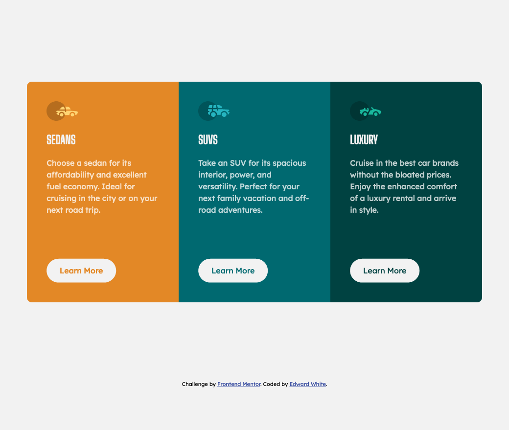

# Frontend Mentor - 3-column preview card component solution

This is a solution to the [3-column preview card component challenge on Frontend Mentor](https://www.frontendmentor.io/challenges/3column-preview-card-component-pH92eAR2-). Frontend Mentor challenges help you improve your coding skills by building realistic projects.

## Table of contents

- [Overview](#overview)
  - [The challenge](#the-challenge)
  - [Screenshot](#screenshot)
  - [Links](#links)
- [My process](#my-process)
  - [Built with](#built-with)
  - [What I learned](#what-i-learned)
- [Author](#author)

## Overview

### The challenge

Users should be able to:

- View the optimal layout depending on their device's screen size
- See hover states for interactive elements

### Screenshot



### Links

- Solution URL: [Frontend Mentor](https://www.frontendmentor.io/solutions/3-column-preview-card-vanilla-css-TvlLvCgWQ)
- Live Site URL: [GitHub Pages](https://ewhite1999.github.io/3-column-preview-card-component-main/)

## My process

### Built with

- Semantic HTML5 markup
- Vanilla CSS
- Flexbox

### What I learned

The main things I learnt/had to look up in this project are:

- A better way to center a page vertically:

```css
.wrapper {
  display: flex;
  flex-direction: column;
  align-items: center;
  justify-content: center;
  min-height: 100vh;
}
```

## Author

- Frontend Mentor - [@ewhite1999](https://www.frontendmentor.io/profile/ewhite1999)
